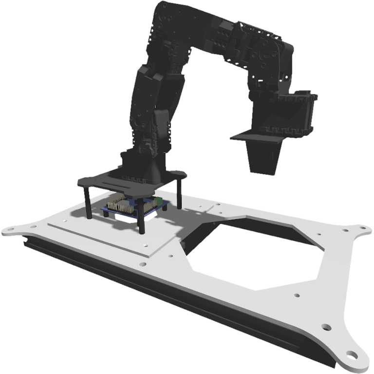

# phantomx_pincher_description

URDF and SDF description of PhantomX Pincher Robot Arm.

<p align="left" float="middle">
  
</p>

## Instructions

### URDF

For URDF, [phantomx_pincher.urdf.xacro](./urdf/phantomx_pincher.urdf.xacro) is the primary descriptor that includes all other xacros and creates a model based on the passed arguments. To generate URDF out of xacro, you can use the included [xacro2urdf.bash](./scripts/xacro2urdf.bash) script and modify its arguments as needed. Once executed, [phantomx_pincher.urdf](./urdf/phantomx_pincher.urdf) will automatically be replaced. Alternatively, `xacro phantomx_pincher.urdf.xacro name:="phantomx_pincher" <arg_i>:=<val_i> ...` can be executed directly, e.g. this is preferred within any launch script.

In order to visualise URDF with RViz2, included [view.launch.py](./launch/view.launch.py) script can be used.

```bash
ros2 launch phantomx_pincher_description view.launch.py
```

### SDF

For SDF, please use the included [xacro2sdf.bash](./scripts/xacro2sdf.bash) script with the desired arguments. This script makes sure that a correct relative path is used to locate all assets.

To visualise SDF with Gazebo, included [view_ign.launch.py](./launch/view_ign.launch.py) script can be used.

```bash
ros2 launch phantomx_pincher_description view_ign.launch.py
```

## Directory Structure

The following directory structure is utilised for this package because it provides compatibility with Gazebo, including [Fuel](https://app.gazebosim.org).

```bash
.
├── config/initial_joint_positions.yaml # List of initial joint positions for fake and simulated ROS 2 control
├── launch/                             # [dir] ROS 2 launch scripts
    ├── view.launch.py                  # Launch script for visualising URDF with RViz2
    └── view_ign.launch.py              # Launch script for visualising SDF with Gazebo
├── phantomx_pincher/                   # [dir] Model directory compatible with Fuel
    ├── meshes/                         # [dir] Meshes for both URDF and SDF
        ├── **/collision/*.stl          # STL meshes for collision geometry
        └── **/visual/*.dae             # COLLADA meshes for visuals
    ├── thumbnails/                     # [dir] Thumbnails for Fuel
    ├── model.config                    # Model meta data
    └── model.sdf                       # SDF (generated from URDF)
├── rviz/view.rviz                      # RViz2 config for visualising URDF
├── scripts/                            # [dir] Additional useful scripts
├── urdf/                               # [dir] URDF description (xacros)
├── CMakeLists.txt                      # Colcon-enabled CMake recipe
└── package.xml                         # ROS 2 package metadata
```
